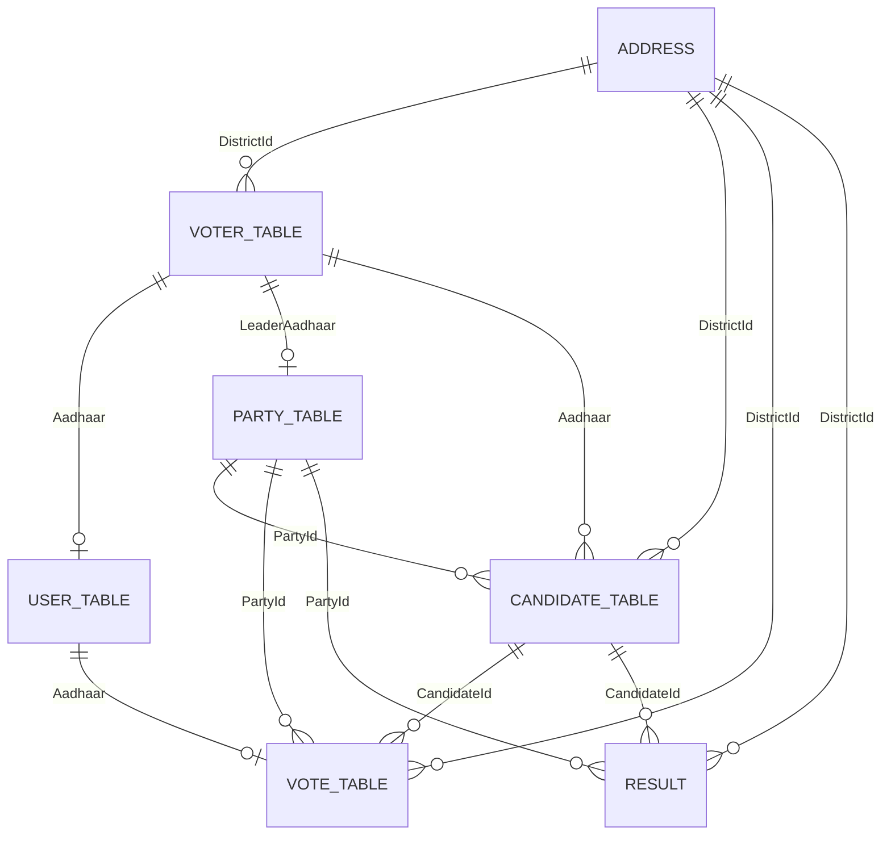

# 🛡️ Secure Digital Voting Platform

A state-of-the-art secure digital voting registry engineered with a high-fidelity glassmorphic dark-theme Web Portal, a secure Python CLI terminal, and a dark obsidian Tkinter Desktop Client.

---

## 🌟 Key Features & Architectural Overhauls

### 🎨 Premium Glassmorphic Web UI
The voter dashboard has been completely modernized into a premium, responsive SaaS aesthetic:
* **Interactive 3-Step Wizard (`signup.html`)**: The registration form is split into a smooth 3-step sequence (**Personal Details** ➔ **Location Details** ➔ **Credentials Setup**) using glowing stepper track node animations.
* **Responsive Visual Symmetry (`results.html`)**: Overhauled the results page into a perfectly balanced dual-column CSS grid. The live vote share doughnut chart and detailed candidate rows match height and scale beautifully on all desktop viewports.
* **Interactive HTML Legend**: Replaced the default, unstylable Chart.js legend with a custom HTML component that supports interactive slice toggles, glowing active indicators, and text-decoration transitions on click.
* **Dynamic Brand-Color Matching**: Synchronized Chart.js segment colors dynamically with active candidate party lines (BJP Orange, INC Blue, AAP Green, default Indigo).
* **Zero Emojis**: Removed browser-misaligned text emojis, replacing them with crisp, uniform inline vector SVG icons (Feather icons) with drop-shadow neon glows.

### 🛡️ High-Grade Security Suite
* **SQL Injection Immunity**: Replaced all string-formatted queries across the Flask backend, python CLI, and Tkinter GUI with fully parameterized SQL statements (`%s`).
* **Cryptographic Password Hashing**: Upgraded plain-text credentials to salted, high-iteration PBKDF2 HMAC SHA-256 hashes. Extended the database schema to support hashed storage (`varchar(255)`).
* **Voter Lockout (Task 3)**: Implemented strict database lookup validations on the voter's `IsActive` flag. Inactive or marked-deceased records are automatically rejected at login with a secure `403 Forbidden` response.
* **District Ballot Isolation**: Enforces voter boundary checks during ballot casting. Votes are validated database-side to confirm the selected candidate is legally registered in the voter's active `DistrictId`.
* **Security Headers**: Injected custom middleware headers (`X-Frame-Options: DENY`, `X-Content-Type-Options: nosniff`, `Referrer-Policy: same-origin`) to prevent clickjacking and frame-sniffing.

### 🖥️ Cyberpunk Tkinter Desktop GUI
* **Obsidian Dark Theme**: Upgraded standard gray Tkinter layouts into a dark cyber-aesthetic with deep obsidian backgrounds (`#060314`), translucent navy input widgets (`#17123a`), flat entry shapes, and neon teal active highlights.
* **Double-Column Registration**: Restructured the 14 sign-up fields into a compact side-by-side grid, decreasing layout height by 50% for high usability.
* **Modern TTK Styles**: Customized flat select combobox controls, arrow borders, and clean track scrollbars.

---

## 📊 Database ER Model & Schema

The platform relies on a normalized MySQL database (`voting_system`) comprising 9 primary tables to maintain absolute electoral integrity.

### Relational Schema



1. **address**: District area mappings including Locality, City, State, and Zip code.
2. **voter_table**: Detailed registration info (Aadhaar, Name, DOB, Age, Phone, District ID).
3. **party_table**: Contesting political parties (Party Name, Symbol, Leader Name, Leader Aadhaar).
4. **candidate_table**: Contesting candidates mapped to their party and registered voting district.
5. **user_table**: Secure login credentials (Voter ID, Aadhaar, PBKDF2 Password Hash, IsActive status).
6. **vote_table**: Auditable voting ledger. Locks voters from duplicate ballot casts.
7. **result**: Aggregated party standings and regional seat counts.

---

## ⚙️ Quick Installation & Setup

### Prerequisites
* Python 3.8+
* MySQL or MariaDB Database Server
* Python packages: `flask`, `mysql-connector-python`

### 1. Database Configuration
1. Open your MySQL client and run the database setup scripts:
   ```bash
   mysql -u root -p < setup_db.sql
   mysql -u root -p < insert_data.sql
   ```
2. Verify database credentials in the `config.json` configuration file at the root of the project:
   ```json
   {
     "host": "127.0.0.1",
     "port": 3306,
     "user": "root",
     "password": "your_db_password",
     "database": "voting_system"
   }
   ```

### 2. Launch the Web Portal
Run the Flask application backend inside the root workspace:
```bash
python web_app.py
```
Open **`http://localhost:8080`** in your browser to access the secure glassmorphic portal.

### 3. Launch the Desktop Client
Launch the modernized obsidian desktop manager:
```bash
python gui_voting_system.py
```

### 4. Launch the CLI System
Explore the cryptographically secure backend terminal:
```bash
python final.py
```

---

## 🔒 Security Best Practices Implemented
* **CSRF Cookie Protections**: Session cookies are configured with `HttpOnly` and `SameSite=Lax` tags to mitigate cross-site request forgery.
* **Strict Age Enforcements**: Automatic date-of-birth validations block registrations under 18 years of age.
* **Aadhaar Format Masking**: Inputs format Aadhaar keys in real-time space masks (`1234 5678 9012`) to prevent data input errors.
